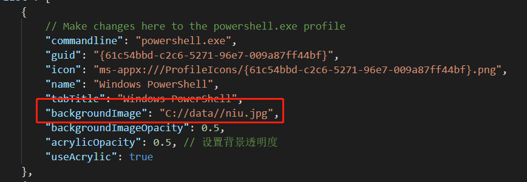

# windows-terminal-config
对windows terminal进行配置，最后的效果如下：


### Powerline配置
使用了[Powerline](https://github.com/powerline/powerline)对Terminal的状态栏进行了配置，所以要使用支持Powerline的字体，在本配置中使用的是[Cascadia Code字体](https://github.com/microsoft/cascadia-code/releases)，该字体可以到跳转的链接中下载，也可以在本项目的[fonts](./fonts)文件夹下获取。你也可以使用其他支持Powerline的字体。

#### 安装Powerline
- 安装字体
1. 在[fonts/CascadiaCode/ttf](./fonts/CascadiaCode/ttf)中找到CascadiaCodePL.ttf文件(Cascadia Code PL既支持连接字也支持powerline字形)。
2. 双击该文件，然后点击安装。
3. 再双击该文件，即可查看字体安装后的名称(Cascadia Code PL)

- 在PowerShell安装Powerline
1. 打开PowerShell，执行如下命令安装 Posh-Git 和 Oh-My-Posh(https://github.com/JanDeDobbeleer/oh-my-posh#themes)：
```
Install-Module posh-git -Scope CurrentUser  # 集成git和PowerShell 的PowerShell模块
Install-Module oh-my-posh -Scope CurrentUser  # oh-my-posh 是 Powershell 的快速主题引擎
```
2. 设置Powerline主题
```
Import-Module posh-git
Import-Module oh-my-posh
Set-Theme Paradox
```

- 在ubuntu安装Powerline
1. 这里使用 Go 和 Powerline-Go 在wsl中安装Powerline，安装之前，需要安装好golang。也可以使用其他方式进行安装。
```
go get -u github.com/justjanne/powerline-go
```
2. 下载完成后在 ~/.bashrc 文件做如下配置：
```
GOPATH=$HOME/go
function _update_ps1() {
    PS1="$($GOPATH/bin/powerline-go -error $?)"
}
if [ "$TERM" != "linux" ] && [ -f "$GOPATH/bin/powerline-go" ]; then
    PROMPT_COMMAND="_update_ps1; $PROMPT_COMMAND"
fi
```

### 生效
安装完毕后将profiles.json文件的内容复制到，windows terminal配置文件中，然后将重启terminal即可。


### 注意
- 背景图片需要改成自己所要使用的图片的路径


- 在[iTerm2-Color-Schemes](https://github.com/mbadolato/iTerm2-Color-Schemes/tree/master/windowsterminal)中，提供了许多主题，可以挑选自己喜欢的主题进行配置。
- [nerd-fonts](https://github.com/ryanoasis/nerd-fonts)提供了许多字体以及制作字体补丁的方法，可以挑选自己喜欢的字体进行配置（需要注意字体是否支持Powerline）。

### 参考
1. https://docs.microsoft.com/zh-cn/windows/terminal/
2. https://github.com/microsoft/terminal
3. https://github.com/Microsoft/Cascadia-Code